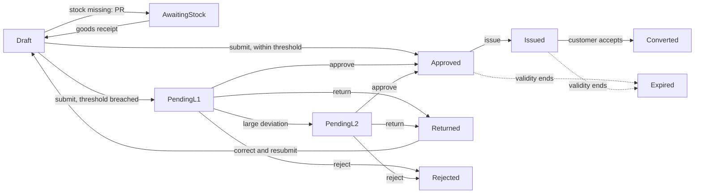

# GMMCO Spares Quotation - CAP Backend

SAP BTP CAP (Node.js) backend for GMMCO's spare-parts quotation process.
A Sales Executive (SE) builds a quotation. The system checks stock, tracks procurement
(PR -> PO -> GR) for missing parts, applies pricing rules, routes the quotation for approval
when price thresholds are breached, and finally converts it to a Sales Order.

**Status:** backend complete with mock S/4HANA data. The automatic smoke test passes (40 of 40 checks).

---

## Contents
1. [Business flow](#business-flow)
2. [Status models](#status-models)
3. [Roles and permissions](#roles-and-permissions)
4. [Quick start](#quick-start)
5. [Services and API reference](#services-and-api-reference)
6. [Business rules](#business-rules)
7. [Example requests](#example-requests)
8. [Data model](#data-model)
9. [Sample data](#sample-data)
10. [Testing](#testing)
11. [Error codes](#error-codes)
12. [Configuration](#configuration)
13. [Project structure](#project-structure)
14. [Integration status](#integration-status)
15. [Assumptions to confirm](#assumptions-to-confirm-with-the-business)
16. [Troubleshooting](#troubleshooting)
17. [Roadmap](#roadmap)

---

## Business flow
1. The Pricing Admin maintains pricing rules (base price, margin, discount limit, minimum price, validity).
2. A customer asks for spare parts. The SE creates a quotation: customer and parts, with quantities.
3. **Stock check** for every part.
   - Stock available: continue.
   - Stock missing: PR created -> PR released -> buyer picks supplier -> PO created ->
     supplier confirms date -> supplier ships -> Goods Receipt (stock goes up).
     The quotation waits in `AwaitingStock` and returns to `Draft` after the goods receipt.
4. Prices are calculated from the pricing rules and the quotation is validated.
5. The SE submits.
   - Price within threshold: **auto-approved**.
   - Price below the minimum threshold: the approver is alerted and approves, rejects or returns it.
     Large deviations need a second approver (Regional Head).
6. The SE shares the approved quotation with the customer (PDF by email). Status becomes **Issued**.
7. The customer accepts: the SE converts it to a **Sales Order**. Otherwise it expires after its validity date.
8. Fulfilment (delivery, invoice, payment) continues in S/4HANA, outside this app.



## Status models

**Quotation status**

| Status | Meaning | Editable | Next steps |
|---|---|---|---|
| `Draft` | Being prepared | Yes | submit, cancel, create PR |
| `AwaitingStock` | Waiting for procurement | Yes | goods receipt returns it to `Draft`, cancel |
| `PendingL1` | Waiting for Sales Manager | No | approve, reject, return, cancel |
| `PendingL2` | Waiting for Regional Head | No | approve, reject, return, cancel |
| `Returned` | Sent back with a comment | Yes | correct and submit again, cancel |
| `Approved` | Approved or auto-approved | No | issue, create sales order |
| `Issued` | Shared with the customer | No | create sales order, expires |
| `Converted` | Sales order created | No | none (fulfilment in S/4HANA) |
| `Rejected`, `Expired`, `Cancelled` | Closed | No | none |

**Item procurement status** (moves forward only)

`None -> PRCreated -> PRReleased -> POCreated -> SupplierConfirmed -> Shipped -> GRPosted`

**Item stock status:** `Unknown`, `InStock`, `NotInStock`, `Partial`

## Roles and permissions

| Role | Can do |
|---|---|
| `PricingAdmin` | Full access to pricing rules; activate and deactivate |
| `SalesExecutive` | Create, edit, delete, recalculate, submit, issue, cancel quotations; create sales orders; create PR |
| `SalesManager` | Level 1 approve, reject, return; own worklist (`myApprovals`) |
| `RegionalHead` | Level 2 approve, reject, return; worklist; read audit log |
| `SupplyChain` | Update procurement status (PR released, PO, supplier date, shipped, goods receipt); create PR |
| `Auditor` | Read-only on quotations, approval history, audit log |
| `JobScheduler` | Call the job service; update procurement |

Additional rules: nobody can approve a quotation they created, and a Sales Manager can only act on `PendingL1`, a Regional Head only on `PendingL2`.

## Quick start

**Prerequisites:** Node.js 20 or later (22 recommended) and npm.

```bash
npm install
npx cds watch
```

The server runs on `http://localhost:4004` with an in-memory SQLite database and loads the sample data automatically.

**Mock users** (password for all: `secret`)

| User | Role |
|---|---|
| `pricing` | PricingAdmin |
| `sales` | SalesExecutive |
| `manager` | SalesManager |
| `head` | RegionalHead |
| `supply` | SupplyChain |
| `auditor` | Auditor |
| `scheduler` | JobScheduler |

Use HTTP Basic authentication, for example `Authorization: Basic sales:secret` in the REST Client extension.

## Services and API reference

Base path: `/odata/v4/<service>`

### `pricing`
| Request | Description |
|---|---|
| `GET /PricingConfigs` | List pricing rules |
| `POST /PricingConfigs` | Create a rule (starts `Inactive`) |
| `PATCH /PricingConfigs(<id>)` | Update a rule (base price changes are audited) |
| `POST /PricingConfigs(<id>)/PricingService.activate` | Activate; blocked if another active rule overlaps |
| `POST /PricingConfigs(<id>)/PricingService.deactivate` | Deactivate |

### `quotation`
| Request | Role | Description |
|---|---|---|
| `GET/POST/PATCH/DELETE /Quotations` | see roles | CRUD; items can be created together with the quotation |
| `POST /Quotations(<id>)/QuotationService.recalculate` | SE | Re-price and re-check stock |
| `POST .../submit` | SE | Validate and route for approval |
| `POST .../approve` `{comments}` | Manager / Head | Approve |
| `POST .../reject` `{comments}` | Manager / Head | Reject (comment mandatory) |
| `POST .../returnForRevision` `{comments}` | Manager / Head | Return to SE (comment mandatory) |
| `POST .../issue` | SE | Mark as shared with the customer |
| `POST .../createSalesOrder` | SE | Convert to a sales order (mock number now) |
| `POST .../cancel` | SE | Cancel |
| `GET /myApprovals()` | Manager / Head | Quotations waiting for the caller |
| `GET/POST/PATCH/DELETE /QuotationItems` | SE | Item maintenance (re-prices the quotation) |
| `POST /QuotationItems(<id>)/QuotationService.createPurchaseRequisition` | SE, Supply chain | Start procurement for a missing item |
| `POST /QuotationItems(<id>)/QuotationService.updateProcurement` `{status, refDoc, expectedDate}` | Supply chain | Move procurement forward |
| `GET /ProcurementEvents`, `/ApprovalHistory`, `/AuditLog` | see roles | Read-only history |

### `masterdata`
`GET /BusinessPartners` and `GET /Materials` (read-only value helps).

### `job`
| Request | Description |
|---|---|
| `POST /expireQuotations` | Approved and Issued quotations past their validity become `Expired` |
| `POST /sendReminders` | Finds quotations pending for more than 24 hours |
| `POST /syncProcurement` | Placeholder for the S/4HANA procurement sync |

## Business rules

**Pricing**
- Rule lookup: an active rule for the exact material, valid today, first; otherwise an active rule for the material group.
- `listPrice = basePrice x (1 + marginPct / 100)`
- `netPrice = listPrice x (1 - discountPct / 100)`
- `lineTotal = netPrice x quantity + deliveryCost`
- Quotation: `netValue` = sum of line totals, `taxValue` = 18% of net, `totalValue` = net + tax.
- A discount above the rule's `maxDiscountPct` is rejected (400).

**Approval thresholds**
- If `netPrice` is below the rule's `minPriceThreshold`, the item is flagged `thresholdBreached`.
- `deviationPct = (minPriceThreshold - netPrice) / minPriceThreshold x 100`
- Deviation up to `approvalL1Limit`: Level 1 (Sales Manager).
- Deviation up to `approvalL2Limit`: Level 2 (Sales Manager, then Regional Head).
- Deviation above `approvalL2Limit`: blocked (400), the SE must reduce the discount.
- The quotation needs the highest level required by any of its items.

**Stock and procurement**
- A quotation cannot be submitted while any item is not fully in stock.
- A PR can only be created for an item that is not in stock, and only once.
- Procurement status only moves forward; `SupplierConfirmed` needs an expected delivery date.
- Goods receipt sets the item to `InStock`. When all items are in stock, an `AwaitingStock` quotation returns to `Draft` and is re-priced.

**Editing**
- Quotations and items can only be changed in `Draft`, `Returned` or `AwaitingStock`.
- Calculated fields (number, status, prices, totals, stock and procurement fields, sales order number) are read-only for clients.

**Audit**
- Every status change, procurement change and pricing-rule activation or base-price change is written to the `AuditLog`.
- Every approval action is written to `ApprovalHistory`.

## Example requests

Create a quotation (Sales Executive):
```http
POST http://localhost:4004/odata/v4/quotation/Quotations
Authorization: Basic sales:secret
Content-Type: application/json

{
  "customerId": "1000002",
  "validFrom": "2026-10-07",
  "validTo": "2026-12-31",
  "currency_code": "INR",
  "items": [ { "material": "CAT-1R0719", "quantity": 10, "discountPct": 2 } ]
}
```
Result: status `Draft`, quotation number `Q-<year>-<number>`, net value 28175, tax 5071.5, total 33246.5.

Submit it:
```http
POST http://localhost:4004/odata/v4/quotation/Quotations(<id>)/QuotationService.submit
Authorization: Basic sales:secret
Content-Type: application/json

{}
```
Result: status `Approved` (auto-approved, price within threshold).

More requests for every flow are in `test/test.http`.

## Data model

| Entity | Purpose |
|---|---|
| `PricingConfigs` | Pricing rules per material or material group |
| `Quotations` | Quotation header with status, totals and sales order number |
| `QuotationItems` | Items with stock, procurement and price fields |
| `ProcurementEvents` | History of PR, PO, supplier and goods receipt steps |
| `ApprovalHistory` | Submit, approve, reject, return and auto-approve records |
| `AuditLog` | Field-level change log |
| `JobLog` | Results of the scheduled jobs |
| `BusinessPartners`, `Materials`, `MaterialStock` | Mock master data (S/4HANA later) |

## Sample data

Loaded from `db/data/` on every start: 20 customers, 20 materials, 20 stock rows, 20 pricing rules, 20 quotations (every status), plus approval history, procurement events, audit log and job log.

CAP only loads CSV files whose names match `<namespace>-<Entity>.csv`, for example `gmmco.quotation-Quotations.csv`, `sap.common-Currencies.csv` and `sap.common-Currencies.texts.csv`.

Useful seeded records:

| Quotation | Status | Try |
|---|---|---|
| Q-2026-00007, Q-2026-00008 | PendingL1 | log in as `manager` and approve or reject |
| Q-2026-00009 | PendingL2 | log in as `head` and approve |
| Q-2026-00010 | Approved | issue it |
| Q-2026-00017 | Returned | correct and resubmit |

## Testing

| File | Use |
|---|---|
| `test/smoke.js` | Runs the main flows automatically and prints PASS or FAIL |
| `test/test.http` | Step-by-step requests for the VS Code REST Client extension, with an `EXPECT` line for each |

```bash
npx cds watch          # terminal 1
node test/smoke.js     # terminal 2
```

Restart `cds watch` before each full run, because the tests change the data.
Latest result: **40 passed, 0 failed**.

## Error codes

| Code | Meaning |
|---|---|
| 400 | Validation failed (missing field, bad discount, no pricing rule, missing comment) |
| 401 | Not logged in |
| 403 | Wrong role, or approving your own quotation |
| 404 | Quotation or item not found |
| 409 | Action not allowed in the current status (locked, already converted, no stock) |
| 501 | S/4HANA Sales Order call configured but not implemented yet |

## Configuration

| Setting | Default | Purpose |
|---|---|---|
| `GMMCO_PLANT` | `1000` | Plant used for the stock check |
| `GST_PCT` in `srv/quotation-service.js` | `18` | Tax percentage (confirm with Finance) |
| `cds.requires.auth` | mocked users | Replaced by XSUAA in production |
| `cds.requires.db` | SQLite locally | Replaced by SAP HANA Cloud in production |

## Project structure
```
db/schema.cds                 data model
db/data/*.csv                 sample data (names must be <namespace>-<Entity>.csv)
srv/pricing-service.*         pricing configuration
srv/quotation-service.*       quotation, stock, procurement, approval logic
srv/masterdata-service.*      master data proxy
srv/job-service.*             scheduled jobs
test/smoke.js                 automatic smoke test
test/test.http                manual test requests
package.json                  dependencies, scripts, mock users
```

## Integration status
| Area | Status |
|---|---|
| Stock check | Local mock table `MaterialStock`; replace with the S/4HANA material stock API |
| Customers and materials | Local mock tables; replace with the Business Partner and Material APIs |
| PR / PO / GR | Local mock numbers; real calls through the Destination Service (TODO) |
| Sales Order | Mock number; Sales Order API call (TODO) |
| Alert Notification | TODO |
| PDF output and email | TODO |
| Authentication | Mocked users locally; XSUAA for production (TODO) |

## Assumptions to confirm with the business
- Tax is 18% GST and the supplying plant is `1000`.
- Two approval levels (Sales Manager, Regional Head) and the deviation limits per rule.
- Who creates the PR and PO: the SE, the supply-chain team, or automatically (MRP).
- Whether the stock check happens before or after approval (here: before, and submit is blocked without stock).
- How the quotation is sent to the customer (PDF by email in the design).

## Troubleshooting
| Problem | Fix |
|---|---|
| Sample data is not loaded | Check the CSV file names use a dot, such as `gmmco.quotation-Quotations.csv` |
| CSV load error about columns | Each row must have the same number of columns as the header |
| Smoke test fails on a second run | Restart `npx cds watch` to reset the in-memory data |
| `401` on every request | Add the `Authorization: Basic user:secret` header |
| `403` on an action | Use the user with the right role (see Roles and permissions) |
| `409` on submit | The quotation has an item that is not in stock, or it is in a locked status |

## Roadmap
1. Backend (this repo) - done
2. UI5/Fiori apps: Pricing Configuration, Quotation Management, Approvals
3. S/4HANA integration: Destination Service, Cloud Connector, material stock, business partner, PR/PO, sales order APIs
4. Alert Notification, PDF output and email
5. `xs-security.json`, `mta.yaml` and deployment to Cloud Foundry
